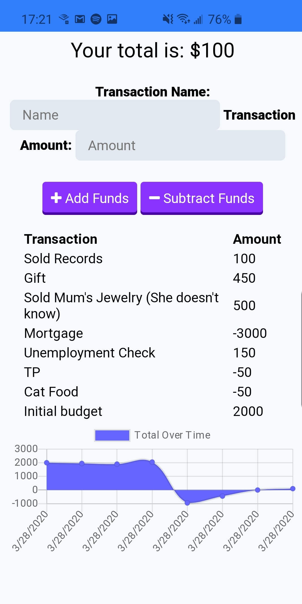

# budget-tracker

This README is a little different to normal, because it isn't so much about the functionality of the app as it it about making it a PWA (Progressive Web App). I had been provided with a fully functioning app and I had to take steps to ensure it met the criteria to be defined as a PWA. What follows is a journey through what I did, with code examples where it mattered.

Check out the repo [here](https://github.com/agtravis/budget-tracker), and see the app in operation [here](http://agtravis-budget-tracker.herokuapp.com/).

## Manifest

The first thing I did was to create a `Web Manifest` file. This is a file that sits at the `public` directory level, and is very simple - all it is a list of properties to tell a browser, written in `JSON` format. The file is called `manifest.webmanifest` by convention, and in order to tell the browser about its existence, a line must be placed in the `<head>` part of the `index.html` file, the line is as follows:

        <link rel="manifest" href="/manifest.webmanifest" />

The actual manifest itself:

    {
    "short_name": "Budget Tracker",
    "name": "Budget Tracker Application",
    "icons": [
        {
            "src": "/assets/images/icons/icon-192x192.png",
            "sizes": "192x192",
            "type": "image/png"
        }
    ],
    "start_url": "/",
    "background_color": "#808080",
    "display": "standalone",
    "theme_color": "#808080"
    }

As can be surmised from this, it contains a few basic but require details so that browser knows what to do in the event it is installed by the user. Icons can be an array of different sizes, but at a minimum the 192x192 size is required and the browser (or OS) can resize as necessary.

## Service Worker

This is a two part process. First you create the service worker, then you have to tell the browser about the service worker via registration.

The service worker itself is made up, in my case, of three parts. It is essentially middleware, and can do anything you want it to, and so I start with a simple console log just to check it is working.

The first part lists all of the files that we want to cache. Whether these are HTML, JavaScript, CSS, images; it's pretty much all the front end static files. Next we set 2 variables that will function as a way to tell the browser "these new incoming files are different, delete the old ones and replace them". This part does not perform that operation, it just enables it to happen:

    const CACHE_NAME = 'static-cache-v1';
    const DATA_CACHE_NAME = 'data-cache-v1';

These strings would have the `v#` version updated when the programmer releases a new service worker/updated files.

Finally, there are the 3 event listeners that tell the browser what to do in each step of the process. The code is very standardized, so not too much description is required.

Installation:

    self.addEventListener(`install`, event => {
        console.log(`begin install`);
        event.waitUntil(
            caches.open(CACHE_NAME).then(cache => {
                console.log(`Your files were pre-cached successfully!`);
                return cache.addAll(FILES_TO_CACHE);
            })
        );
        self.skipWaiting();
    });

This is where the files are cached.

Activation:

    self.addEventListener(`activate`, event => {
        console.log(`being activate`);
        event.waitUntil(
            caches.keys().then(keyList =>
                Promise.all(
                    keyList.map(key => {
                    if (key !== CACHE_NAME && key !== DATA_CACHE_NAME) {
                            console.log(`Removing old cache data`, key);
                            return caches.delete(key);
                        }
                        return undefined;
                    })
                )
            )
        );
    self.clients.claim();
    });

This is where the version is checked, if it is the same the browser gets the files from the cache, if not it deletes the old files and re-chaches.

Fetch:

    self.addEventListener(`fetch`, event => {
        console.log(`begin fetch`);
        if (event.request.url.includes(`/api/`)) {
            event.respondWith(
                caches
                    .open(DATA_CACHE_NAME)
                    .then(cache => fetch(event.request).then(response => {
                        if (response.status === 200) {
                            cache.put(event.request.url, response.clone());
                        }
                        return response;
                    })
                    .catch(() => cache.match(event.request))
                )
                .catch(err => console.error(err))
            );
        } else {
                    event.respondWith(
                        caches
                            .match(event.request)
                            .then(response => response || fetch(event.request))
                    );
                }
            });

This is the longest part, but it effectively tells the browser what to do in case of an offline instance. If the URL includes `/api/` then the browser knows it is not a page that will be rendered, so an attempt will be made to supply a pretend response based on previous calls. If not, a page will be rendered from cached files.

Finally the service worker needs to be registered. This happens in the front end JavaScript code, in my example I created a `main.js`. The code there:

    if ('serviceWorker' in navigator) {
        window.addEventListener('load', () => {
            navigator.serviceWorker.register('service-worker.js').then(reg => {
                console.log('We found your service worker file!', reg);
            });
        });
    }

First checks that the browser is compatible with a service worker, then if so, registers the server with the browser for this site.

## Screenshots

Here is the app, succesfully downloaded and in operation (from Heroku) on my Android phone:

## Further Development

Since this was a simple task to implement (based on previous examples), I spent a lot of time investigating using webpack.

I was unable to succesfully navigate a service-worker implementation through webpack, and I wanted to switch my focus at this time to concentrate on learning React, and so I stopped. However, even though I was unsuccessful, this time was not wasted, I learned a great deal about webpack. This can be seen below in my `webpack.config.js` file (on [GitHub](https://github.com/agtravis/budget-tracker-2/blob/d44b0ee91ffc1bbf996ad7195cf93597462461f9/public/webpack.config.js)) (not that this is not the most up to date commit in that repo, the commits following are reverts I made, so this could be considered the furthest I had proceeded):

    const HtmlWebpackPlugin = require('html-webpack-plugin');
    const config = {
        entry: {
            entry: `./db.js`
        },
        output: {
            path: `${__dirname}/dist`,
            filename: `[name].[contentHash].bundle.js`
        },
        mode: `development`,
        module: {
            rules: [
                {
                    test: /\.css$/,
                    use: ['style-loader', 'css-loader']
                },
                {
                    test: /\.js$/,
                    exclude: /node_modules/,
                    use: {
                        loader: `babel-loader`,
                        options: {
                            presets: [`@babel/preset-env`]
                        }
                    }
                }
            ]
        },
        plugins: [
            new HtmlWebpackPlugin({
            template: 'index.html'
            })
        ]
    };
    module.exports = config;

Everything above was successful - All my javascript files are linked together via ES6 `imports`, including the CSS, the `[contentHash]` worked correctly and the next step would have been to ensure that previous builds would have been deleted. The reason to use this feature is so that a stored cache can tell which are new files and when to update. Again, the reason I stopped was because I could not link to my service-worker, and that was the whole point of the exercise. I understand conceptually what would be required to get this to work.
